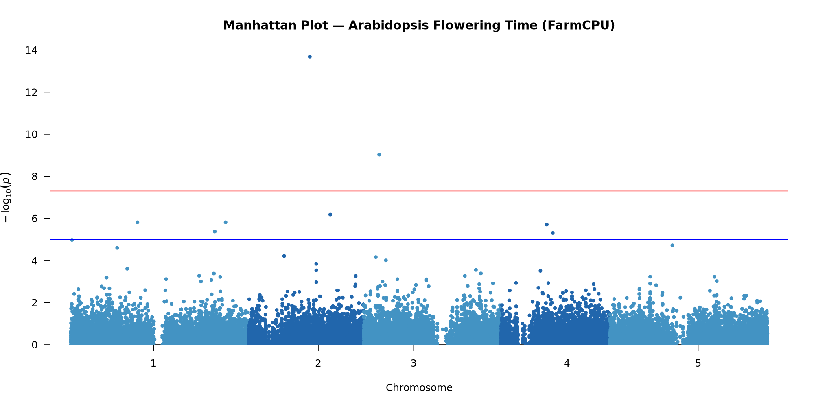
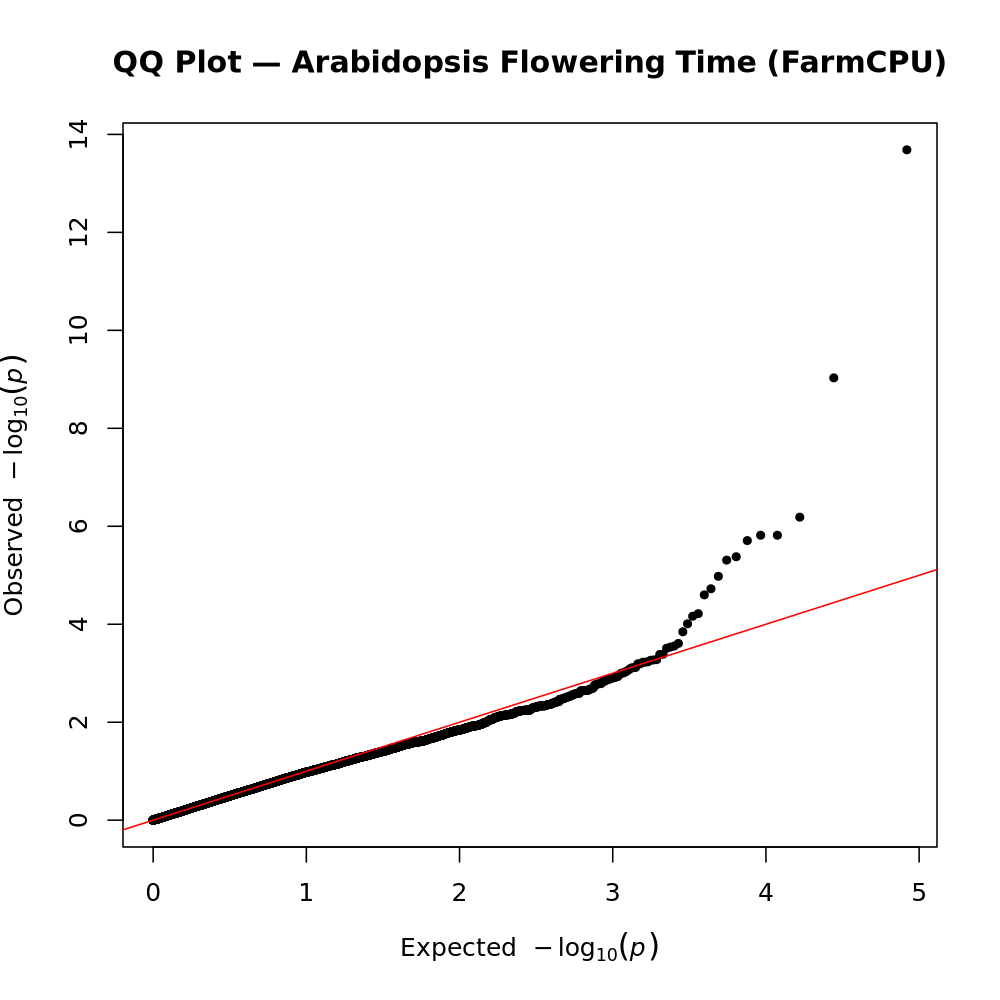

### Overview:
This tutorial walks you through a complete genome-wide association study (GWAS) pipeline using publicly available data from *Arabidopsis thaliana*. By the end, you will have run every step from raw VCF filtering to Manhattan and QQ plots using a series of modular shell scripts.

---
## Step-by-Step Tutorial
### Getting Started

**1. Fork [this repository](https://github.com/The-Graduate-Life/Arabidopsis-GWAS-Pipeline)**

Click the **Fork** button in the upper right corner of this page. After a few seconds you will have your own copy of the repository in your GitHub account.

**2. Clone your fork**

On your fork's page, click the green **Code** button and copy the URL. Then in your terminal:

```bash
git clone <the-url-you-just-copied>
cd Arabidopsis-GWAS-Pipeline
```

**3. Verify**

You should now be in your local copy of the repository:

```bash
ls scripts/
```

You are ready to proceed with the setup. 

**4. Download the raw data**
```bash
# Download the genotype VCF (~19 GB — this will take a while)
wget https://1001genomes.org/data/GMI-MPI/releases/v3.1/1001genomes_snp-short-indel_only_ACGTN.vcf.gz \
    -P data/raw/

# Download the phenotype data
wget "https://arapheno.1001genomes.org/phenotype/6/values.csv" \
    -O data/raw/FT_Field_phenotype.csv
```

>All commands below assume you are in the **project root**.


### Step 0: Subset the Data

> *Skip this step if you are using the pre-built subset in `data/subset/`. Proceed to Step 1.

This step selects a manageable number of accessions from the full 1001 Genomes VCF using a **geographically stratified random sample**, which preserves population structure across Eurasia. It then extracts those accessions from the VCF and writes a matching phenotype file.

**Script:** `scripts/00_subset_data.sh`

**Usage:**

```bash
bash scripts/00_subset_data.sh <vcf> <phenotype> <outdir> [n_accessions]
```

**Arguments:**

|Argument|Description|Example|
|-|-|-|
|`vcf`|Path to the full 1001G VCF|`data/raw/1001genomes_snp-short-indel_only_ACGTN.vcf.gz`|
|`phenotype`|Path to the AraPheno CSV|`data/raw/FT_Field_phenotype.csv`|
|`outdir`|Output directory|`data/subset`|
|`n_accessions`|Number of accessions to sample (default: 150)|`100`|

**Example run:**

```bash
bash scripts/00_subset_data.sh \
    data/raw/1001genomes_snp-short-indel_only_ACGTN.vcf.gz \
    data/raw/FT_Field_phenotype.csv \
    data/subset 100
```

**What it does:**

1. Reads all sample IDs from the VCF header
2. Joins with the phenotype file to find overlapping accessions
3. Performs a geographically stratified random sample (bins by latitude/longitude)
4. Writes `sample_ids.txt` (one ID per line) and `phenotype_subset.csv`
5. Calls `bcftools view --samples-file` to extract the chosen accessions into a new VCF

**Outputs:**

|File|Description|
|-|-|
|`data/subset/subset.vcf.gz`|Subsetted, bgzipped VCF|
|`data/subset/subset.vcf.gz.csi`|CSI index|
|`data/subset/sample_ids.txt`|Accession IDs, one per line|
|`data/subset/phenotype_subset.csv`|Phenotype file for selected accessions|

**Expected terminal output:**

```
=============================================
 Step 1: Select 100 accessions
=============================================
VCF contains 1135 samples
Accessions overlapping with VCF: 312
Unique accessions after dedup: 312
Stratified sample across 16 geographic cells
Selected 100 accessions  →  data/subset/sample_ids.txt
...
=============================================
 Summary
=============================================
  Samples in subsetted VCF : 100
  SNPs retained            : 4679817
  VCF output               : data/subset/subset.vcf.gz
  Phenotype output         : data/subset/phenotype_subset.csv
```

### Step 0a: Select Accessions and Download Phenotype

> *Skip this step if you are using the pre-built subset in `data/subset/`. Proceed to Step 0b.*

This step downloads the phenotype data from AraPheno, selects a manageable number of accessions from the full 1001 Genomes VCF using a **geographically stratified random sample**, and writes a matching phenotype file. Population structure across Eurasia is preserved by binning accessions into latitude/longitude grid cells before sampling.

**Script:** `scripts/00_subset_data.sh`

**Usage:**
```bash
bash scripts/00_subset_data.sh [n_accessions] [study_id]
```

**Arguments:**

| Argument | Description | Default |
|-|-|-|
| `n_accessions` | Number of accessions to sample | `150` |
| `study_id` | AraPheno study ID to download | `12` |

**Example run:**
```bash
bash scripts/00_subset_data.sh 100 12
```

**What it does:**
1. Downloads the phenotype CSV from AraPheno (`study 12` = FT16 + FT10)
2. Reads all sample IDs from the VCF header
3. Joins with the phenotype file to find overlapping accessions
4. Performs a geographically stratified random sample (bins by latitude/longitude)
5. Writes `sample_ids.txt` and `phenotype_subset.csv`

**Outputs:**

| File | Description |
|-|-|
| `data/raw/phenotype_raw.csv` | Raw phenotype file downloaded from AraPheno |
| `data/subset/sample_ids.txt` | Selected accession IDs, one per line |
| `data/subset/phenotype_subset.csv` | Phenotype file for selected accessions |


### Step 0b: Subset the VCF

> *Skip this step if `data/subset/subset.vcf.gz` already exists. Proceed to Step 1.*

This step extracts the selected accessions from the full 1001 Genomes VCF using `bcftools`. It is separated from Step 0a because it is **memory intensive** and can be submitted as a batch job on HPC systems.

**Script:** `scripts/00b_subset_vcf.sh`

**Usage:**
```bash
bash scripts/00b_subset_vcf.sh       # local machine
qsub scripts/00b_subset_vcf.sh       # HPC (PBS)
```

**What it does:**
1. Reads `data/subset/sample_ids.txt` produced by Step 0a
2. Calls `bcftools view --samples-file` to extract chosen accessions
3. Drops SNPs that become monomorphic after subsetting (`--min-ac 1:minor`)
4. bgzips and indexes the output VCF

**Outputs:**

| File | Description |
|-|-|
| `data/subset/subset.vcf.gz` | Subsetted, bgzipped VCF |
| `data/subset/subset.vcf.gz.csi` | CSI index |

**Expected terminal output:**
```
Subsetting VCF to 100 accessions...
  Input  : data/raw/1001genomes_snp-short-indel_only_ACGTN.vcf.gz
  Samples: data/subset/sample_ids.txt
  Output : data/subset/subset.vcf.gz

=============================================
 Summary
=============================================
  Samples : 100
  SNPs    : 4679817
  Output  : data/subset/subset.vcf.gz

✓ Done. Run the pipeline with:
  bash scripts/run_pipeline.sh
  qsub scripts/run_pipeline.sh
```


### Step 1: Filter the VCF

This step applies the first layer of variant-level quality control directly on the VCF before converting to PLINK format.

**Script:** `scripts/01_filter_vcf.sh`

**Usage:**

```bash
bash scripts/01_filter_vcf.sh <vcf> <out>
```

**Arguments:**

|Argument|Description|Example|
|-|-|-|
|`vcf`|Input subsetted VCF|`data/subset/subset.vcf.gz`|
|`out`|Output filtered VCF path|`data/subset/filtered.vcf.gz`|

**Example run:**

```bash
bash scripts/01_filter_vcf.sh \
    data/subset/subset.vcf.gz \
    data/subset/filtered.vcf.gz
```

**Filters applied:**

|Filter|Flag|Rationale|
|-|-|-|
|Biallelic SNPs only|`-m2 -M2 -v snps`|Multiallelic sites and indels complicate downstream analysis|
|Missingness < 10%|`-i 'F_MISSING<0.1'`|Variants missing in > 10% of samples have low reliability|

**Outputs:**

|File|Description|
|-|-|
|`data/subset/filtered.vcf.gz`|Filtered, bgzipped VCF|
|`data/subset/filtered.vcf.gz.tbi`|Tabix index|

**Expected terminal output:**

```
Filtering VCF...
  Input  : data/subset/subset.vcf.gz
  Output : data/subset/filtered.vcf.gz
  Filters: biallelic SNPs only, missingness < 10%

✓ VCF filtered → <N> SNPs retained: data/subset/filtered.vcf.gz
```


### Step 2: Convert VCF to PLINK

PLINK's binary format (`.bed`/`.bim`/`.fam`) is required by PLINK's QC tools and is also readable by the SNPRelate and GAPIT3 R packages.

**Script:** `scripts/02_vcf_to_plink.sh`

**Usage:**

```bash
bash scripts/02_vcf_to_plink.sh <vcf> <out>
```

**Arguments:**

|Argument|Description|Example|
|-|-|-|
|`vcf`|Filtered VCF from Step 1|`data/subset/filtered.vcf.gz`|
|`out`|Output PLINK file prefix|`data/plink/raw`|

**Example run:**

```bash
bash scripts/02_vcf_to_plink.sh \
    data/subset/filtered.vcf.gz \
    data/plink/raw
```

**Key PLINK flags:**

|Flag|Purpose|
|-|-|
|`--allow-extra-chr`|Accepts Arabidopsis chromosome names (1–5, not chr1–chr5)|
|`--set-missing-var-ids @:#`|Assigns `CHROM:POS` IDs to any unlabelled variants|
|`--make-bed`|Produces binary `.bed` / `.bim` / `.fam` output|

**Outputs:**

|File|Description|
|-|-|
|`data/plink/raw.bed`|Binary genotype matrix|
|`data/plink/raw.bim`|Variant information (chr, id, pos, alleles)|
|`data/plink/raw.fam`|Sample information|

**Expected terminal output:**

```
Converting VCF to PLINK...
  Input  : data/subset/filtered.vcf.gz
  Output : data/plink/raw.bed / .bim / .fam

✓ PLINK files generated → 100 samples, <N> SNPs
```


### Step 3: Quality Control

This step applies standard GWAS QC thresholds to remove low-quality variants and samples.

**Script:** `scripts/03_qc_plink.sh`

**Usage:**

```bash
bash scripts/03_qc_plink.sh <bfile> <out>
```

**Arguments:**

|Argument|Description|Example|
|-|-|-|
|`bfile`|PLINK prefix from Step 2|`data/plink/raw`|
|`out`|Output QC-filtered PLINK prefix|`data/plink/qc`|

**Example run:**

```bash
bash scripts/03_qc_plink.sh \
    data/plink/raw \
    data/plink/qc
```

**QC filters applied:**

|Filter|Threshold|Flag|Rationale|
|-|-|-|-|
|Minor allele frequency|MAF ≥ 5%|`--maf 0.05`|Very rare variants have insufficient power in small datasets|
|SNP missingness|< 10%|`--geno 0.1`|Removes poorly genotyped variants|
|Sample missingness|< 10%|`--mind 0.1`|Removes poorly genotyped individuals|
|Hardy–Weinberg equilibrium|Disabled|`--hwe 0`|*A. thaliana* is a selfing species; HWE does not apply|

**Outputs:**

|File|Description|
|-|-|
|`data/plink/qc.bed`|QC-filtered genotype matrix|
|`data/plink/qc.bim`|QC-filtered variant information|
|`data/plink/qc.fam`|QC-filtered sample information|

**Expected terminal output:**

```
Running QC...
  Input  : data/plink/raw
  Output : data/plink/qc
  Filters: MAF >= 0.05 | geno < 0.1 | mind < 0.1 | HWE disabled

✓ QC complete → <N_samples> samples, <N_snps> SNPs: data/plink/qc
```


### Step 4: PCA & Kinship

This step uses the **SNPRelate** R package to compute:

* **PCA scores** — used as fixed-effect covariates in the GWAS model to correct for population stratification
* **Kinship matrix** — used as a random-effect covariance structure to account for genetic relatedness

**Script:** `scripts/04_pca_kinship.sh` (calls `scripts/04_pca_kinship.R`)

**Usage:**

```bash
bash scripts/04_pca_kinship.sh <bfile> <outdir>
```

**Arguments:**

|Argument|Description|Example|
|-|-|-|
|`bfile`|QC-filtered PLINK prefix|`data/plink/qc`|
|`outdir`|Output directory|`results/pca`|

**Example run:**

```bash
bash scripts/04_pca_kinship.sh \
    data/plink/qc \
    results/pca
```

**What the R script does:**

1. Converts PLINK binary files to GDS format (required by SNPRelate)
2. Computes PCA via `snpgdsPCA()` — extracts PC1 and PC2
3. Computes an IBS kinship matrix via `snpgdsIBS()`
4. Writes both to CSV files

**Outputs:**

|File|Description|
|-|-|
|`results/pca/PCA.csv`|Sample × PC matrix (Taxa, PC1, PC2)|
|`results/pca/Kinship.csv`|Sample × sample kinship matrix|
|`results/pca/arabidopsis.gds`|Intermediate GDS file (can be deleted)|

**Expected terminal output:**

```
Running PCA and kinship estimation...
  Input  : data/plink/qc
  Output : results/pca

✓ PCA & kinship complete → results/pca
```


### Step 5: Run GWAS

This step runs the GWAS using the **FarmCPU** model in **GAPIT3**. FarmCPU uses the PCA scores as fixed-effect covariates and the kinship matrix as a random-effect covariance to control for population structure and relatedness simultaneously.

**Script:** `scripts/05_gwas.sh` (calls `scripts/05_gwas.R`)

**Usage:**

```bash
bash scripts/05_gwas.sh <phenotype> <geno> <outdir>
```

**Arguments:**

|Argument|Description|Example|
|-|-|-|
|`phenotype`|Phenotype CSV with a `Taxa` column|`data/subset/phenotype_subset.csv`|
|`geno`|QC-filtered PLINK prefix|`data/plink/qc`|
|`outdir`|Output directory for GWAS results|`results/gwas`|

**Example run:**

```bash
bash scripts/05_gwas.sh \
    data/subset/phenotype_subset.csv \
    data/plink/qc \
    results/gwas
```

**Phenotype file format:**

The phenotype file must have a `Taxa` column whose values match the sample IDs in the PLINK `.fam` file. Additional columns are the trait values. Missing values (`NA`) are allowed.

```
Taxa,FT16,FT10
9564,,122.25
9568,109.5,103.75
9820,55.75,61.75
```

**Outputs:**

|File|Description|
|-|-|
|`results/gwas/GAPIT.FarmCPU.csv`|Full association results (one row per SNP)|
|`results/gwas/GAPIT.FarmCPU.*.pdf`|Manhattan and QQ plots from GAPIT3 (built-in)|

**The output CSV columns:**

|Column|Description|
|-|-|
|`SNP`|Variant ID (`CHR:POS`)|
|`Chr`|Chromosome|
|`Pos`|Base-pair position|
|`P.value`|Association p-value|
|`effect`|Estimated allelic effect|
|`se`|Standard error of the effect|
|`R2`|Proportion of phenotypic variance explained|
|`FDR_Adjusted_P-values`|Benjamini–Hochberg FDR-corrected p-value|

**Expected terminal output:**

```
Running GWAS (FarmCPU via GAPIT3)...
  Phenotype : data/subset/phenotype_subset.csv
  Genotype  : data/plink/qc
  Output    : results/gwas

✓ GWAS complete → results/gwas
```

> This step is computationally intensive and may take several minutes depending on the number of SNPs and accessions.


### Step 6: Plot Results

This step generates a **Manhattan plot** and a **QQ plot** from the GWAS results using the **qqman** R package.

**Script:** `scripts/06_plot_results.sh` (calls `scripts/06_plot_results.R`)

**Usage:**

```bash
bash scripts/06_plot_results.sh <gwas_file>
```

**Arguments:**

|Argument|Description|Example|
|-|-|-|
|`gwas_file`|GAPIT3 results CSV from Step 5|`results/gwas/GAPIT.FarmCPU.csv`|

**Example run:**

```bash
bash scripts/06_plot_results.sh \
    results/gwas/GAPIT.FarmCPU.csv
```

**Outputs:**

|File|Dimensions|Description|
|-|-|-|
|`results/figures/Manhattan.png`|2000 × 1000 px|SNP associations across all chromosomes|
|`results/figures/QQ.png`|1000 × 1000 px|Observed vs. expected p-value distribution|

**Expected terminal output:**

```
Generating plots...
  Input  : results/gwas/GAPIT.FarmCPU.csv
  Output : results/figures/Manhattan.png
           results/figures/QQ.png

✓ Plots saved → results/figures/Manhattan.png & QQ.png
```


## Step 7: Running the Full Pipeline at Once

If you already have the subsetted data in `data/subset/` (either from Step 0 or the pre-built subset), you can run the entire pipeline with a single command:

```bash
bash scripts/run_pipeline.sh
```

The master script runs Steps 1–6 in order, validates that required input files exist before starting, and prints a summary of all output locations when complete.

>**Customizing paths:** All input/output paths are defined as variables at the top of `run_pipeline.sh`. Edit them if your directory structure differs from the default:

```bash
readonly VCF_IN="data/subset/subset.vcf.gz"
readonly VCF_FILTERED="data/subset/filtered.vcf.gz"
readonly PLINK_RAW="data/plink/raw"
readonly PLINK_QC="data/plink/qc"
readonly PHENO="data/subset/phenotype_subset.csv"
readonly OUTDIR_PCA="results/pca"
readonly OUTDIR_GWAS="results/gwas"
```

**Expected summary at completion:**

```
=====================================
   ✓ Pipeline complete
=====================================

  Filtered VCF    : data/subset/filtered.vcf.gz
  PLINK QC files  : data/plink/qc.bed / .bim / .fam
  PCA & kinship   : results/pca
  GWAS results    : results/gwas/GAPIT.FarmCPU.csv
  Figures         : results/figures/Manhattan.png & QQ.png
```


## Step 8: Interpreting the Results

### Manhattan Plot

The Manhattan plot shows `-log10(p-value)` for each SNP across the five Arabidopsis chromosomes. Each point is one SNP; the x-axis is chromosomal position and the y-axis is the strength of association.

* **Horizontal red line** — genome-wide significance threshold (drawn at p < 5 × 10⁻⁸)
* ***Horizontal blue line*** — Suggestive significance threshold (Drawn at −log₁₀(1×10⁻⁵))
* **Peaks** — clusters of significant SNPs suggest a genomic region harboring a causal variant
* Well-known flowering-time loci in Arabidopsis include *FLC* (chromosome 5) and *FRI* (chromosome 4)

<p align="center">
  
  <br>
  <em>Figure 1. Manhattan plot for flowering time at 10°C (FT10) in Kansas accessions. 
  The red dashed line indicates the genome-wide significance threshold (p < 5×10⁻⁸).</em>
</p>

     
### QQ Plot

The QQ plot compares the distribution of observed p-values (y-axis) to what would be expected under the null hypothesis of no association (x-axis). Both axes are on the `-log10` scale.

* **Points along the diagonal** — indicates the model is well-calibrated; most SNPs show no association, as expected
* **Deviation upward at the tail** — indicates true association signals rising above the null
* **Early departure from the diagonal** — called **genomic inflation**, and indicates uncorrected population stratification or other systematic bias. A well-fitted model (with PCA and kinship correction) should show points tracking the diagonal until the true signal region.

<p align="center">
  
  <br>
  <em>Figure 2. QQ plot for flowering time at 10°C (FT10) in Kansas accessions. 
  The red line represents the expected distribution under the null hypothesis. 
  Deviation from the diagonal indicates true associations.</em>
</p>


## Step 9: Troubleshooting

+ **`ERROR: Subset VCF not found`**

Make sure you have run Step 0 or that `data/subset/subset.vcf.gz` exists. The pre-built subset is included in the repository.

+ **`command not found: bcftools` / `plink` / `Rscript`**

These tools must be on your `PATH`. Install them via conda and activate the environment before running the scripts:

```bash
conda activate gwas_env
```

+ **R package installation failures**

GAPIT3 requires several Bioconductor dependencies. Install them first:

```r
BiocManager::install(c("multtest", "gplots", "LDheatmap", "genetics",
                       "ape", "EMMREML", "scatterplot3d"))
devtools::install_github("jiabowang/GAPIT3", force = TRUE)
```

> ***Lucky you 😊, all these packages and dependencies are included in step 0 with the script `00_subset_data.sh`.***


+ **`set -euo pipefail` causes the script to exit unexpectedly**

Run the failing step manually with `bash -x scripts/<script>.sh ...` to see exactly which command failed and why.

---


## How to Cite

If you use this pipeline in your work, please cite:

> Pierre, F. (2026). *GWAS Analysis Pipeline for Arabidopsis thaliana Flowering Time Using Public Data*. GitHub. https://github.com/The-Graduate-Life/Arabidopsis-GWAS-Pipeline

Please also cite the underlying tools (see [References](PROJECT_DETAILS.md#8-references) in [the project details document](PROJECT_DETAILS.md)).

## AI Disclosure

This pipeline was completed with the assistance of **[Claude](https://claude.ai)** (Anthropic).

AI assistance was used for:
- Debugging shell scripts and R code
- Refining docstring-style script headers
- Troubleshooting conda environment and R package installation
- Adapting the pipeline for HPC submission (PBS)

All biological decisions, pipeline design, data selection, and interpretation of results were made by the author. AI-generated code and documentation were reviewed, tested, and modified before inclusion in the final pipeline.

---
